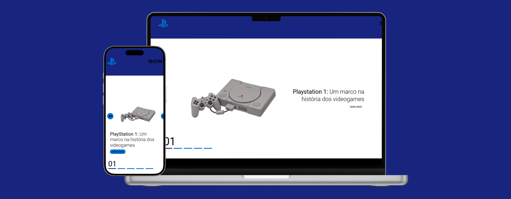

# PlayStation - Linha do Tempo

Este projeto apresenta uma linha do tempo interativa sobre a evolução dos consoles PlayStation, desde o PlayStation 1 até o PlayStation 5. O objetivo é proporcionar uma experiência visual e informativa sobre cada console, destacando seus marcos históricos e características. **[Link do projeto](https://davirrocha.github.io/playstation/)**

## Tecnologias Utilizadas

- HTML5

- CSS3

- JavaScript

- Google Fonts

# Funcionalidades

- Apresentação de cada console PlayStation com imagens e descrições.

- Botão "Saiba Mais" para acessar páginas individuais dos consoles.

- Navegação entre os consoles através de setas.

- Indicador visual para mostrar o console atualmente exibido.

